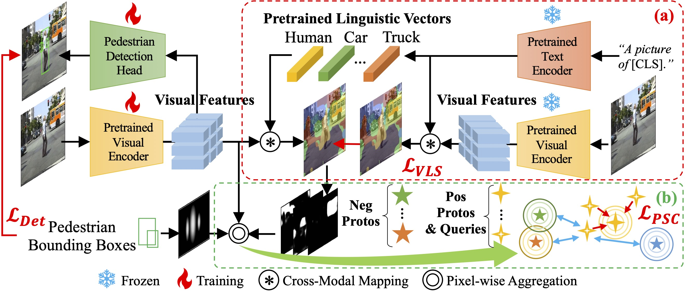
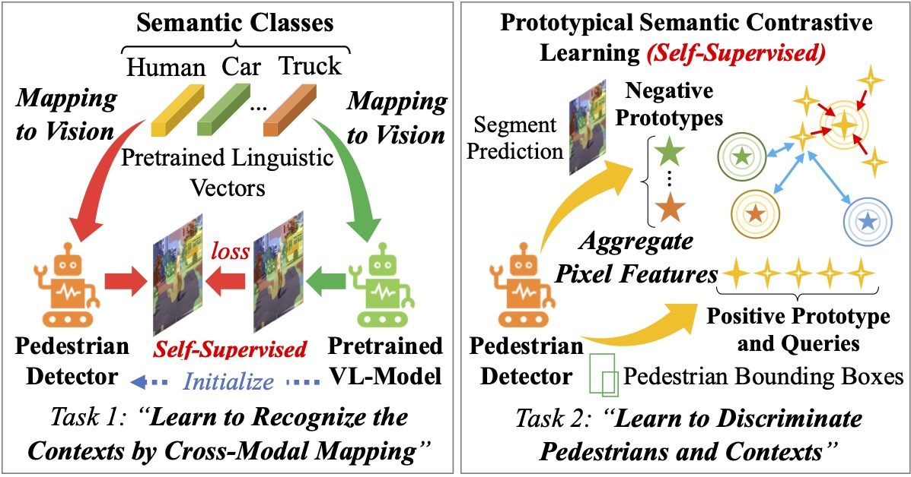
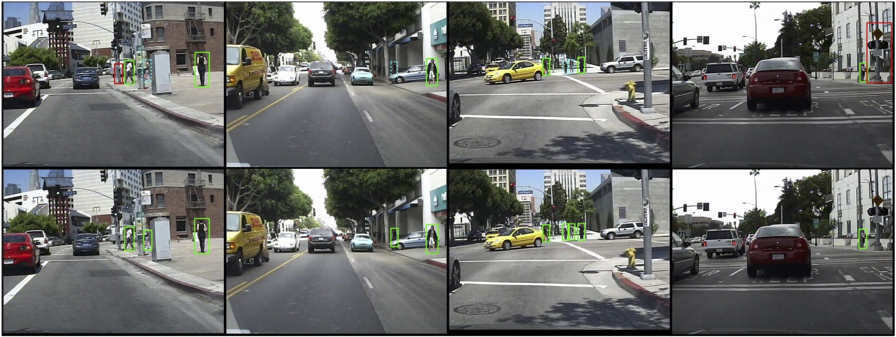

# VLPD
Official Code of CVPR'23 Paper "VLPD: Context-Aware Pedestrian Detection via Vision-Language Semantic Self-Supervision"

\[[Paper](https://openaccess.thecvf.com/content/CVPR2023/html/Liu_VLPD_Context-Aware_Pedestrian_Detection_via_Vision-Language_Semantic_Self-Supervision_CVPR_2023_paper.html)\] \[[arXiv](https://arxiv.org/abs/2304.03135)\] \[[Supp. Materials](https://openaccess.thecvf.com/content/CVPR2023/supplemental/Liu_VLPD_Context-Aware_Pedestrian_CVPR_2023_supplemental.pdf)\] 



## Introduction


We propose in this paper a novel approach via Vision-Language semantic self-supervision for context-aware Pedestrian Detection (VLPD) to model explicitly semantic contexts without any extra annotations:
* Firstly, we propose a self-supervised Vision-Language Semantic (VLS) segmentation method, which learns both fully-supervised pedestrian detection and contextual segmentation via self-generated explicit labels of semantic classes by vision-language models. 
* Furthermore, a self-supervised Prototypical Semantic Contrastive (PSC) learning method is proposed to better discriminate pedestrians and other classes, based on more explicit and semantic contexts obtained from VLS. 
* Extensive experiments on popular benchmarks CityPersons and Clatech show that our proposed VLPD achieves superior performances over the previous state-of-the-arts, particularly under challenging circumstances like small scale and heavy occlusion. 

Below are the visualizations of detection results on Caltech dataset between the baseline CSP (top) and our proposed VLPD (bottom). Green are correct detections, red are wrong detections, and dashed blue are missing detections.



## Contents
1. [Introduction](#introduction)
1. [Environment](#step-1-environment)
2. [Dataset](#step-2-dataset)
3. [Training](#step-3-training)
4. [Evaluation](#step-4-evaluation)

## STEP 1: Environment
1. Software and Hardware requirements: 
    * Install the conda (miniconda3 is recommended) for creating environment.
    * Matlab 2021a (or above) is recommended for evaluation on Caltech.
    * At least one Nvidia GPU which supports CUDA 11 is required. (*> 24G x 2 for training is recommended*)

2. Create conda environment:
    * Modify the "name" item of "environment.yaml" to name the environment, and change the "prefix" item to your conda path. 
    * Run "conda env create -f environment.yaml" to create a new environment.
    * If some install errors occur due to invalid CUDA versions of PyTorch-related packages by PIP, try install the *.whl files manually from [official site](https://download.pytorch.org/whl/torch_stable.html). 

3. Compile the NMS for current python version:
    * Change the working directory to the folder by "cd utils/".
    * Under the created conda environment, run "make" for compilng. 

4. Install the PIP package of CLIP
    * Please refer to the official repository [openai/CLIP](https://github.com/openai/CLIP). And install it via "pip3" of the created conda environment.
    * Download the ResNet50-CLIP weight: [RN50.pt](https://openaipublic.azureedge.net/clip/models/afeb0e10f9e5a86da6080e35cf09123aca3b358a0c3e3b6c78a7b63bc04b6762/RN50.pt).
    * Keep "clip_weight" item in "config.py" consistent to where this weight is saved.

## STEP 2: Dataset
1. For CityPersons:
    * Following the instruction of official repository [cvgroup-njust/CityPersons](https://github.com/cvgroup-njust/CityPersons), download the images (leftImg8bit_trainvaltest.zip (11GB)) of CityScapes dataset and [annotations file](https://github.com/cvgroup-njust/CityPersons/tree/master/annotations) (*.mat).

    * If the data path is "/root/data", place images and annotations in the path format like (take validation set as example):
        ```
        /root/data/cityperson/images/val/frankfurt/frankfurt_000000_000294_leftImg8bit.png

        /root/data/cityperson/annotations/anno_val.mat
        ```

2. For Caltech: 
    * Following the instruction of the baseline method [liuwei16/CSP](https://github.com/liuwei16/CSP) to prepare the [cached files](https://github.com/liuwei16/CSP/tree/master/data/cache) and images of Caltech dataset (42782 for training, 4024 for testing (2.2GB in total)).
    * If the data path is "/root/data/", place images and annotations in the path format like:
        ```
        /root/data/caltech/images/train_3/images/
        /root/data/caltech/images/test/images/

        /root/data/cache/caltech/train_gt
        /root/data/cache/caltech/train_nogt
        /root/data/cache/caltech/test
        ```

3. If the data path has been customized, change the "root_path" item in "config.py" or "config_caltech.py"

4. Due to the copyright issues, we can not release the copies of generated data that we used.

## STEP 3: Training
1. For CityPersons:
    * Under the conda environment you created, Run "dist_train.sh" to start training. 
    * Training hyper-parameters are set in "config.py".

2. For Caltech:
    * Under the conda environment you created, Run "dist_train_caltech.sh" to start training.
    * Training hyper-parameters are set in "config_caltech.py".

* **NOTE:** For more details about configs not in "config.py", please refer to [Others.md](./docs/Others.md#about-training).

## STEP 4: Evaluation
1. For CityPersons:
    * Miss-Rate is printed in training log of each evalution epoch, from "val_begin" to "val_end" in "config.py" during training. 
    * If you need to evaluate single checkpoints or get results on other subsets, please refer to [Evaluation.md](docs/Evaluation.md#evaluate-the-results-on-citypersons).

2. For Caltech:
    * Detection result files are generated in MODEL_DIR directory, from epoch "val_begin" to "val_end" in "config_caltech.py" during training. 
    * To get Miss-Rate of these generated files, please refer to [Evaluation.md](docs/Evaluation.md#evaluate-the-results-on-caltech).

* Checkpoints of our VLPD are available to download in [Evaluation.md](docs/Evaluation.md). 
* **NOTE:** Adjusting "val_begin" will affect the reproducibility, please refer to [Others.md](docs/Others.md#about-reproducibility). 

## Citation
If you find our research helpful or make further research, please consider citing: 

```
@InProceedings{Liu_2023_CVPR,
    author    = {Liu, Mengyin and Jiang, Jie and Zhu, Chao and Yin, Xu-Cheng},
    title     = {VLPD: Context-Aware Pedestrian Detection via Vision-Language Semantic Self-Supervision},
    booktitle = {Proceedings of the IEEE/CVF Conference on Computer Vision and Pattern Recognition (CVPR)},
    month     = {June},
    year      = {2023},
    pages     = {6662-6671}
}
```

For our more publications, please refer to Mengyin Liu's [Academic Page](https://lmy98129.github.io/academic) and Google Scholar of [Prof. Zhu](https://scholar.google.com/citations?user=4PookxMAAAAJ) and [Prof. Yin](https://scholar.google.com/citations?user=V3hiob0AAAAJ).

## Thanks
1. Official code of the baseline CSP: [liuwei16/CSP](https://github.com/liuwei16/CSP)
2. Unofficial PyTorch implementation of CSP: [ligang-cs/CSP-Pedestrian-detection](https://github.com/ligang-cs/CSP-Pedestrian-detection)
3. Official code of OpenAI-CLIP: [openai/CLIP](https://github.com/openai/CLIP)